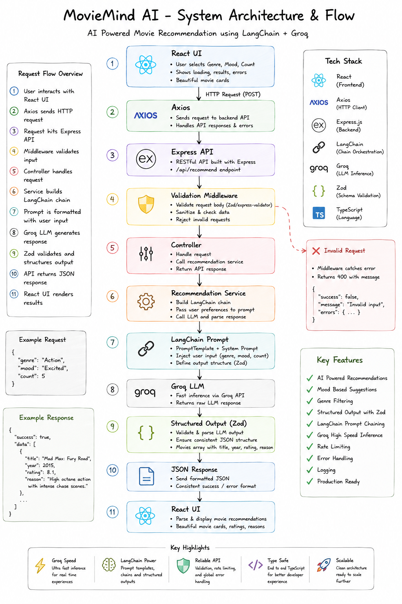

# 🎬 MovieMind AI

> **Learning LangChain by building real AI applications, one concept at a time.**


## Live Demo

- **Frontend:** https://movie-ai-alpha.vercel.app/
- **Backend API:** https://movie-ai-ezym.onrender.com
---

# Why I Built This

MovieMind AI is **not intended to be "just another movie recommendation website."**

I built it to learn the engineering behind modern AI applications using **LangChain**, **LLMs**, and **production backend architecture**.

My goal is to evolve this repository gradually into a much larger AI ecosystem featuring:

- Retrieval Augmented Generation (RAG)
- Memory
- Tool Calling
- LangGraph
- MCP
- AI Agents
- Multi-agent workflows

This repository represents **Phase 1** of that journey.

---

# Current Status

✅ Backend architecture completed

✅ LangChain integration

✅ Prompt engineering

✅ Structured outputs

✅ Production Express architecture

⚠️ UI is functional but still under active development. Minor animation and responsive glitches remain because the focus of this milestone was backend AI engineering rather than UI polish.

---

# Learning Objectives

Instead of directly calling an LLM API, I wanted to understand:

- Prompt Templates
- System vs Human Messages
- LCEL
- Runnable Interface
- invoke()
- pipe()
- Structured Outputs
- Zod Integration
- Backend architecture
- Error handling
- Validation
- Rate limiting

---

# Architecture


---

# Request Flow

1. User selects Genre, Mood and Count.
2. Frontend sends POST request.
3. Request validated using Zod.
4. Controller calls Recommendation Service.
5. LangChain builds PromptTemplate.
6. Prompt piped into Groq Chat Model.
7. Structured output generated.
8. Zod validates AI response.
9. JSON returned to frontend.
10. Movie cards rendered.

---

# Tech Stack

## Frontend

- React 19
- TypeScript
- Vite
- Tailwind CSS v4
- Axios
- Framer Motion

## Backend

- Node.js
- Express 5
- TypeScript
- LangChain
- Groq
- Zod
- Helmet
- Morgan
- Pino
- Express Rate Limit

---

# Why Groq instead of Gemini?

Initially the project used Google Gemini.

During development I repeatedly exhausted the free-tier quota, making experimentation difficult.

I migrated to Groq because it offers:

- Faster inference
- Better free limits
- OpenAI-compatible API
- Excellent LangChain integration
- Easier experimentation while learning

---

# Backend Highlights

- Environment validation
- Request validation
- Async handler
- Global error middleware
- 404 middleware
- API response wrapper
- Rate limiting
- Logging
- Structured AI output
- Service-based architecture

---

# Folder Structure

```text
backend/
 ├── config/
 ├── controllers/
 ├── middlewares/
 ├── prompts/
 ├── routes/
 ├── schemas/
 ├── services/
 ├── utils/
 ├── app.ts
 └── server.ts

frontend/
 ├── components/
 ├── hooks/
 ├── pages/
 ├── services/
 ├── types/
 └── App.tsx
```

---

# API

## Health

GET `/health`

## Recommendation

POST `/api/recommend`

Example

```json
{
  "genre":"Action",
  "mood":"Excited",
  "count":5
}
```

---

# Engineering Decisions

| Decision | Reason |
|-----------|--------|
| Express | Clean backend separation |
| LangChain | Learn production AI architecture |
| Zod | Request + AI output validation |
| TypeScript | End-to-end type safety |
| Service Layer | Separation of concerns |
| Rate Limiting | Prevent API abuse |
| Prompt Templates | Reusable prompts |
| Structured Output | Reliable JSON responses |

---

# Challenges

- Gemini free quota limitations
- Understanding Runnable Interface
- Designing prompts for reliable JSON
- Deployment (Render + Vercel)
- Environment configuration
- CORS debugging

---

# Lessons Learned

This project taught me that building AI applications is much more than calling an API.

The biggest learning outcomes were:

- Designing reusable prompts
- Producing deterministic outputs
- Backend architecture
- Validation-first development
- Thinking in AI pipelines instead of single API calls

---

# Known Limitations

- Minor UI glitches remain
- No authentication yet
- No movie posters
- No persistence/database
- No streaming responses
- No conversation memory

These are planned improvements.

---

# Future Roadmap

## Phase 2

- TMDB integration
- Posters
- Search
- Better UI polish
- Streaming responses

## Phase 3

- Authentication
- Watchlists
- Favorites
- User profiles
- Recommendation history

## Phase 4

- RAG
- Vector Database
- Semantic Search
- Memory
- LangGraph
- MCP
- Tool Calling
- Multi-Agent workflows
- LangSmith observability

---

# Related Project

This repository is part of my AI learning roadmap.

Previous project:

**AI Knowledge Base Chat (RAG)**

https://github.com/tanishxdev/movie-ai/tanishxdev/AI-Knowledge-Base-Chat-RAG

The goal is to progressively build toward production-ready AI systems rather than isolated demos.

Next project: To be determined based on what I learn from this project.
---

# Running Locally

```bash
git clone https://github.com/tanishxdev/movie-ai/tanishxdev/movie-ai

cd backend
npm install
npm run dev

cd ../frontend
npm install
npm run dev
```

---

# Environment

Backend

```env
PORT=
GROQ_API_KEY=
GROQ_MODEL=
NODE_ENV=
RATE_LIMIT_WINDOW_MS=
RATE_LIMIT_MAX=
```

Frontend

```env
VITE_API_URL=
```

---

# About Me

**Tanish Kumar**

- GitHub: https://github.com/tanishxdev/movie-ai/tanishxdev
- Portfolio: https://thisistanishcodelab.vercel.app/

I enjoy learning backend engineering, distributed systems, DevOps, and modern AI application development. This repository documents that learning journey publicly.
